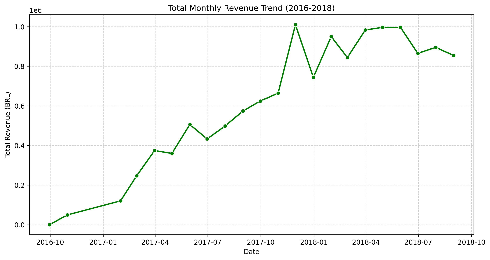
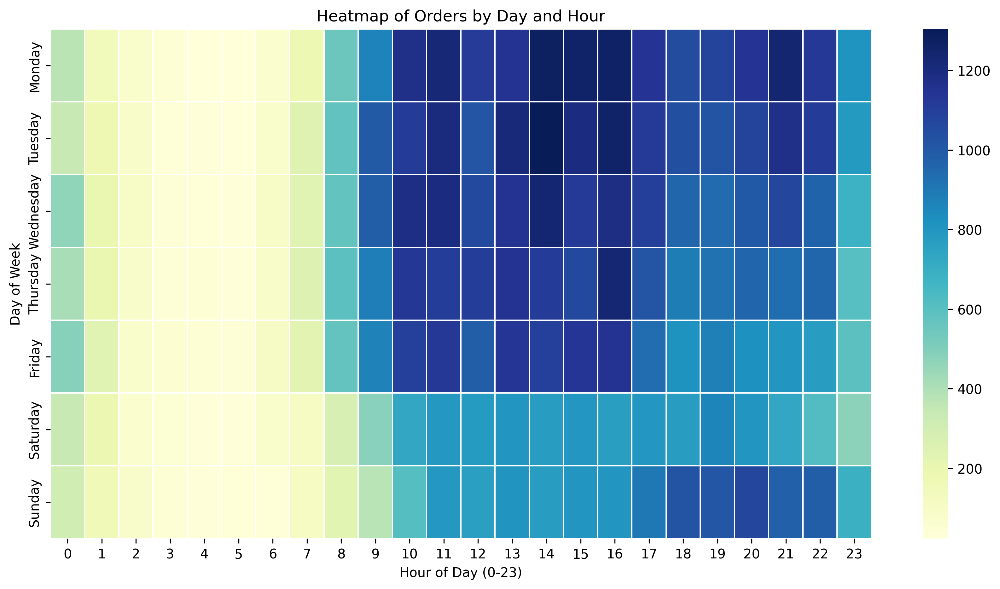
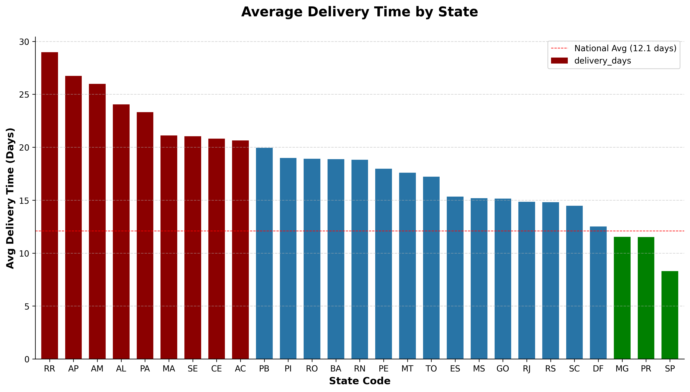
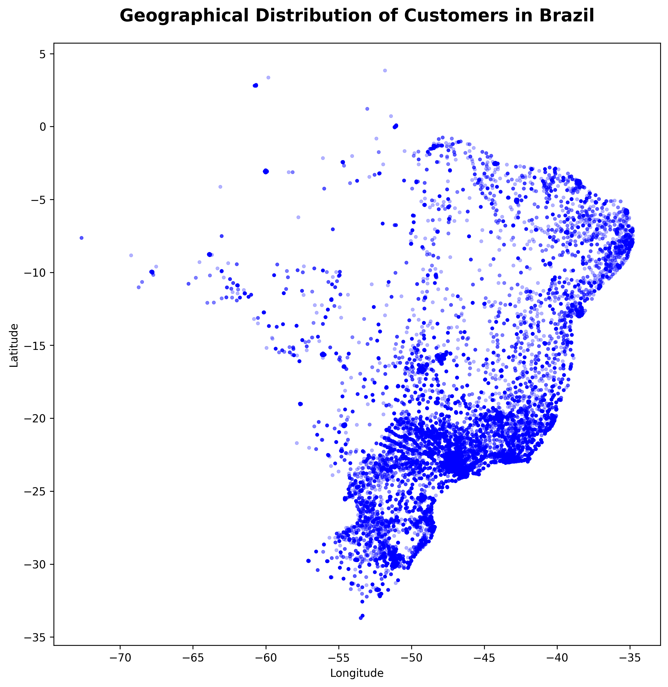

# Olist E-Commerce Business Analysis

[](https://www.python.org/)
[](https://jupyter.org/)
[](https://pandas.pydata.org/)
[](https://opensource.org/licenses/MIT)

An end-to-end exploratory data analysis of the **Brazilian E-Commerce** dataset from [Olist](https://www.kaggle.com/datasets/olistbr/brazilian-ecommerce). The project examines **99,441 orders** across sales trends, delivery logistics, customer segmentation, product quality, payment behaviour, seller performance, and geospatial patterns to derive actionable business insights.

---

## Table of Contents

- [Project Overview](#project-overview)
- [Dataset](#dataset)
- [Tech Stack](#tech-stack)
- [Getting Started](#getting-started)
- [Project Structure](#project-structure)
- [Analysis Highlights](#analysis-highlights)
- [Key Findings](#key-findings)
- [Sample Visualizations](#sample-visualizations)
- [Contributing](#contributing)
- [License](#license)

---

## Project Overview

| Field | Details |
|-------|---------|
| **Author** | Mubin |
| **Domain** | E-Commerce · Data Analysis |
| **Objective** | Derive strategic, data-driven recommendations for Olist by analysing sales performance, logistics efficiency, customer value, and regional market dynamics |
| **Data Source** | [Olist Brazilian E-Commerce (Kaggle)](https://www.kaggle.com/datasets/olistbr/brazilian-ecommerce) |

---

## Dataset

The analysis uses **9 interrelated CSV files** covering orders placed on the Olist marketplace between 2016 and 2018.

| File | Records | Description |
|------|--------:|-------------|
| `olist_orders_dataset.csv` | 99,441 | Order timestamps, status, and delivery dates |
| `olist_order_items_dataset.csv` | 112,650 | Product line items, prices, and freight values |
| `olist_order_payments_dataset.csv` | 103,886 | Payment method, installments, and amounts |
| `olist_order_reviews_dataset.csv` | 99224 | Customer review scores and comments |
| `olist_customers_dataset.csv` | 99,441 | Customer geographic information |
| `olist_products_dataset.csv` | 32,951 | Product categories, dimensions, and weight |
| `olist_sellers_dataset.csv` | 3095 | Seller profiles and locations |
| `olist_geolocation_dataset.csv` | 1000163 | Latitude / longitude by zip code |
| `product_category_name_translation.csv` | 71 | Portuguese → English category mapping |

> **Note:** Place all CSV files in the `data/` directory before running the notebook.

---

## Tech Stack

| Library | Purpose |
|---------|---------|
| **Pandas** ≥ 1.5.0 | Data manipulation and aggregation |
| **NumPy** ≥ 1.21.0 | Numerical computing |
| **Matplotlib** ≥ 3.5.0 | Static visualizations |
| **Seaborn** ≥ 0.12.0 | Statistical plotting |
| **Folium** ≥ 0.14.0 | Interactive geospatial maps |
| **OpenPyXL** ≥ 3.0.0 | Excel report generation |
| **TextBlob** ≥ 0.17.1 | Sentiment analysis on review text |

---

## Getting Started

### Prerequisites

- Python 3.10+ (developed on 3.13.5)
- Jupyter Notebook or JupyterLab

### Installation

```bash
# 1. Clone the repository
git clone https://github.com/iaMubin/Olist_e-com_analysis.git
cd Olist_e-com_analysis

# 2. (Optional) Create a virtual environment
python -m venv .venv
source .venv/bin/activate   # Windows: .venv\Scripts\activate

# 3. Install dependencies
pip install -r requirements-olist.txt

# 4. Download the dataset from Kaggle and place CSVs in data/
#    https://www.kaggle.com/datasets/olistbr/brazilian-ecommerce

# 5. Launch the notebook
jupyter notebook Olist_Ecommerce_Analysis.ipynb
```

---

## Project Structure

```
Olist_e-com_analysis/
│
├── Olist_Ecommerce_Analysis.ipynb   # Main analysis notebook
├── Olist_Ecommerce_Analysis.html    # HTML Formated
├── Olist_Ecommerce_Analysis.pdf     # PDF export of the notebook
├── requirements-olist.txt           # Python dependencies
│
├── data/                            # Raw Olist CSV datasets
│   ├── olist_orders_dataset.csv
│   ├── olist_order_items_dataset.csv
│   ├── olist_order_payments_dataset.csv
│   ├── olist_order_reviews_dataset.csv
│   ├── olist_customers_dataset.csv
│   ├── olist_products_dataset.csv
│   ├── olist_sellers_dataset.csv
│   ├── olist_geolocation_dataset.csv
│   └── product_category_name_translation.csv
│
├── all_PLOTS/                       # Exported visualizations
│   ├── All_Plots.png                       (PNG + PDF)
│   └── All_Plots.pdf
│
├── reports/                         # Generated Excel reports
│   └── analytical_insights.xlsx
│
├── README.md
│
└── LICENSE
```

---

## Analysis Highlights

The notebook is organized into the following sections:

1. **Environment Setup & Data Loading** — Library imports, reproducibility settings (`RANDOM_STATE = 42`), and data validation.
2. **Dataset Overview & Data Quality** — Schema inspection, missing values, and order-status distribution.
3. **Sales Trend & Temporal Analysis** — Monthly revenue trends, seasonality, and sales heatmaps by day-of-week and hour.
4. **Delivery Performance & Logistics** — Actual vs. estimated delivery comparison, late-delivery rates by state, and worst-performing sellers by dispatch delays.
5. **Customer Segmentation (RFM Analysis)** — Recency, Frequency, and Monetary scoring to classify customers into value tiers (e.g., Champions, At-Risk).
6. **Product Quality Analysis** — Review-score distributions across product categories to surface quality-control issues.
7. **Payment Behaviour Analysis** — Payment-method share, credit-card dominance (74%), and installment-plan preferences.
8. **Seller Analysis** — Top revenue-generating sellers, revenue concentration (Pareto distribution), and seller churn risk.
9. **Regional Analysis** — State-level revenue, sales volume, average freight cost, and interactive Folium customer-density maps.
10. **Conclusions & Strategic Recommendations** — Executive summary with a three-pillar action plan.

---

## Key Findings

| Area | Insight |
|------|---------|
| **Logistics** | Late deliveries significantly lower review scores; certain states and sellers consistently underperform on shipping SLAs. |
| **Customer Retention** | ~96% of customers make only a single purchase, indicating weak retention and a need to shift spend from acquisition to loyalty programs. |
| **Payment** | Credit cards account for **74%** of transactions; Boleto (a Brazil-specific cash-based method) represents **~19%** — critical to maintain both channels. |
| **Seller Concentration** | ~20% of sellers generate ~80% of total revenue, creating significant business risk if top sellers churn. |
| **Regional Gaps** | Several states show high customer demand but low seller supply — strategic opportunities for local seller recruitment to cut freight costs and delivery times. |

### Strategic Action Plan

1. **Optimize Operational Resilience** — Enforce seller accountability (e.g., three-strike policy) and renegotiate logistics SLAs in high-latency regions.
2. **Retain High-Value Customers** — Reallocate marketing budget toward RFM-based retention campaigns during peak demand windows.
3. **Expand Selectively** — Recruit sellers in states with elevated customers-per-seller ratios to reduce delivery cost and time.

---

## Sample Visualizations

A selection of charts generated during the analysis:

| Monthly Sales Trend | Sales Heatmap |
|:---:|:---:|
|  |  |

| Delivery Performance by State | Customer Density Map |
|:---:|:---:|
|  |  |

> Browse the full set of 22+ visualizations in the [`all_PLOTS/`](all_PLOTS/) directory or view the compiled [All_Plots.pdf](all_PLOTS/All_Plots.pdf).

---

## Contributing

Contributions are welcome! If you would like to improve the analysis or add new features:

1. Fork the repository
2. Create a feature branch (`git checkout -b feature/your-feature`)
3. Commit your changes (`git commit -m 'Add your feature'`)
4. Push to the branch (`git push origin feature/your-feature`)
5. Open a Pull Request

---

## License

This project is licensed under the [MIT License](https://opensource.org/licenses/MIT).

---

<p align="center">
  <i>If you found this analysis useful, consider giving the repo a ⭐</i>
</p>
